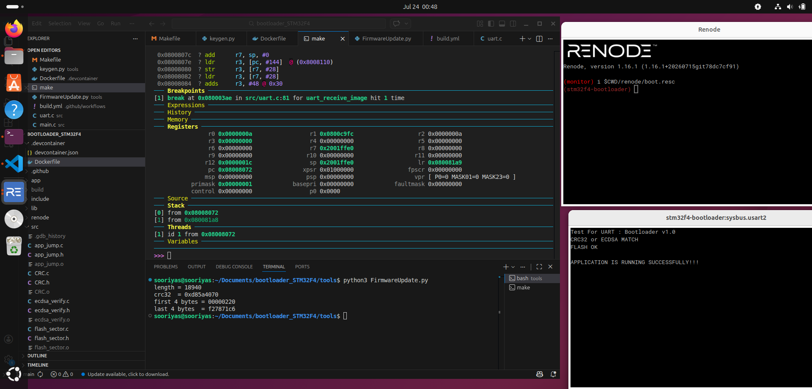
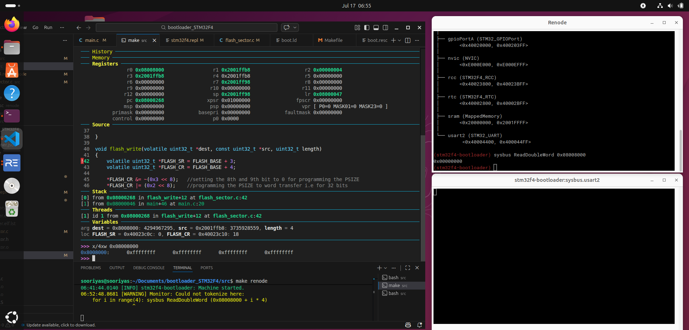
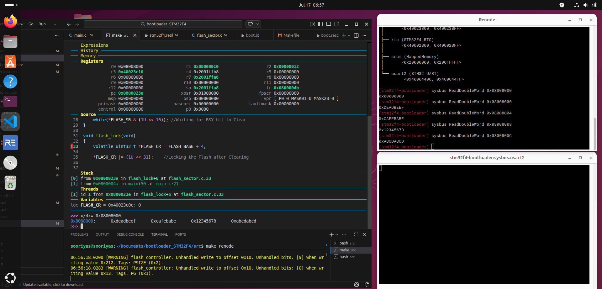
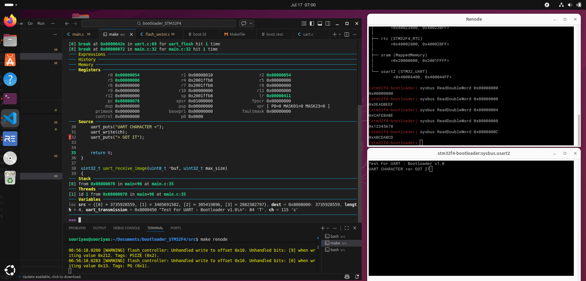
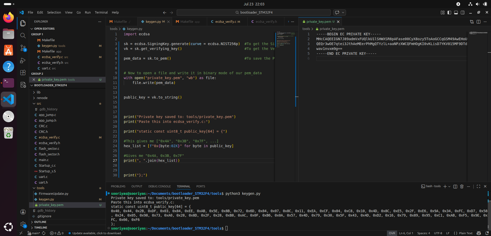

# Bare-Metal Bootloader — STM32F4 (Cortex-M4)

A production-grade bare-metal bootloader built from scratch on STM32F4, simulated in Renode. No HAL. No CubeMX. Every byte is owned.



---

## Demo

▶️ [Watch the full pipeline running in Renode](https://youtu.be/UhMtHUWgMFE)

---

## What this does

```
Power on
  └─> Reset_Handler (startup.S)
        └─> Copy .data from flash to RAM, zero .bss
              └─> uart_init()
                    └─> Wait for UART signal (2s timeout)
                          ├─> [Signal received] Receive firmware over UART
                          │     └─> CRC32 validate
                          │           └─> ECDSA P-256 signature verify
                          │                 └─> flash_erase() + flash_write()
                          │                       └─> Jump to new app
                          └─> [Timeout] Jump to existing app
                                └─> SCB->VTOR = APP_BASE
                                      └─> __set_MSP(app_stack)
                                            └─> app_reset_handler()
```

---

## Stack

| Layer | Technology |
|---|---|
| Target | STM32F407 — ARM Cortex-M4 |
| Simulation | Renode 1.16.1 |
| Toolchain | arm-none-eabi-gcc, arm-none-eabi-gdb |
| Crypto | micro-ecc (P-256 ECDSA), SHA-256 |
| Host tool | Python 3 — FirmwareUpdate.py |
| CI | GitHub Actions |

---

## Repo structure

```
.
├── src/                  # Bootloader source
│   ├── Startup_s.S       # Reset_Handler — written in assembly
│   ├── Startup_c.c       # .data copy, .bss zero, branch to main
│   ├── main.c            # Boot decision logic
│   ├── uart.c            # UART driver — register level, no HAL
│   ├── flash_sector.c    # Flash erase + write via FLASH_CR registers
│   ├── CRC.c             # CRC32 computation
│   ├── app_jump.c        # VTOR relocation + MSP set + branch to app
│   └── ecdsa_verify.c    # SHA-256 hash + uECC_verify
├── app/                  # Minimal test application
├── lib/
│   ├── micro-ecc/        # ECDSA P-256 (third party)
│   └── sha256/           # SHA-256 (third party)
├── tools/
│   ├── FirmwareUpdate.py # Sends firmware over UART: magic + length + payload + CRC32 + ECDSA sig
│   └── keygen.py         # Generates P-256 keypair, prints public key as C array
├── renode/
│   ├── boot.resc         # Renode simulation script
│   └── stm32f4.repl      # Platform description
├── .devcontainer/        # VS Code devcontainer — Renode + toolchain + Python deps
├── .github/workflows/    # GitHub Actions CI — build pipeline
├── boot.ld               # Custom linker script — no generated files
└── Makefile
```

---

## Build and run

```bash
# Build
make run

# Simulate in Renode
make renode

# Send firmware (in a second terminal)
cd tools && python3 FirmwareUpdate.py

# Debug with GDB
make gdb
```

---

## What was built — milestone by milestone

### 1. Linker script and memory map

Custom `boot.ld` — defines FLASH origin at `0x08000000`, RAM at `0x20000000`. Places `.text` in flash, `.data` with `AT > FLASH` so it loads from flash and runs from RAM. Linker symbols `_sdata`, `_edata`, `_sbss`, `_ebss` drive the startup copy loop.

No generated files. Every address is a deliberate decision.

### 2. Reset handler in assembly

`Startup_s.S` owns the machine from the first instruction. Fetches MSP from vector table[0], copies `.data` from LMA to VMA in a loop, zeros `.bss`, then branches to `main()`.

Verified in Renode + GDB: breakpoints at Reset_Handler, at the copy loop, and at `main()`. RAM contents confirmed correct before `main()` is entered.

### 3. Flash driver — register level

`flash_sector.c` erases and writes flash via raw `FLASH_CR` register manipulation. No HAL, no StdPeriph.

**Before erase** — flash at `0x08000000` reads all zeros (Renode default):



**After erase** — sector reads `0xFFFFFFFF` across all words, confirming the erase completed:

**After write** — test values `0xDEADBEEF`, `0xCAFEBABE`, `0x12345678`, `0xABCDABCD` confirmed in flash at `0x08000000`:



### 4. UART driver — register level

`uart.c` configures baud rate, GPIO alternate function, and Tx/Rx entirely through registers. No HAL.

UART echo test — bootloader receives a character and echoes it back. Renode UART analyzer confirms `UART CHARACTER <s> GOT IT`:



### 5. Full firmware update pipeline

Packet structure sent from host to bootloader over UART:

```
[ 0x69 | 4-byte length | firmware bytes | 4-byte CRC32 | 64-byte ECDSA signature ]
```

`FirmwareUpdate.py` builds and sends this packet. Bootloader receives, validates CRC32, verifies ECDSA signature, erases flash, writes firmware, and jumps to the new application.

### 6. ECDSA P-256 firmware signing

`keygen.py` generates a P-256 keypair using the `ecdsa` library. The public key is hardcoded into `ecdsa_verify.c` as a `uint8_t[64]` array at compile time. The private key signs the firmware on the host before transmission.

Key generation — private key saved to `tools/private_key.pem`, public key printed as a C array ready to paste:



Signing flow:
- Host: `SHA-256(firmware)` → 32-byte hash → `sign_digest(hash, private_key)` → 64-byte signature
- Bootloader: `SHA-256(firmware)` → 32-byte hash → `uECC_verify(hash, signature, public_key)` → 1 or 0

### 7. End-to-end verified

Full pipeline running — CRC32 match, ECDSA match, flash written, application jumps and prints:


```
Test For UART : Bootloader v1.0
CRC32 or ECDSA MATCH
FLASH OK
APPLICATION IS RUNNING SUCCESSFULLY!!!
```

---

## CI — GitHub Actions

Every push to `main` automatically:
1. Installs `arm-none-eabi-gcc`
2. Runs `make run`
3. Confirms `Bootloader.elf` was produced

Build badge lives on every commit. Pipeline defined in `.github/workflows/build.yml`.


